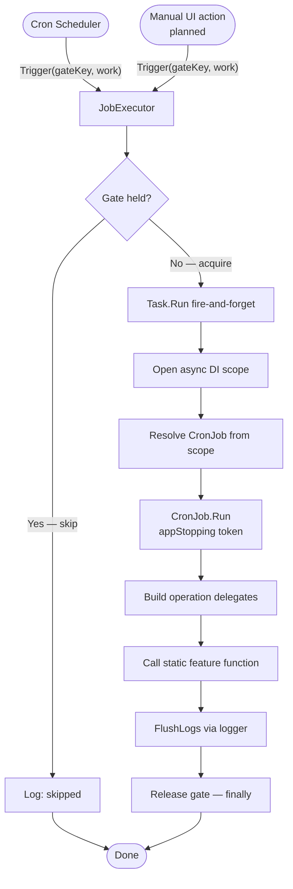

# Background Jobs

*Created: 2026-06-06*

Background work in AnimeFeedManager runs as named, cron-scheduled jobs executed in-process by a single injectable executor. There is no message queue. The system is built around four principles: one execution primitive (`JobExecutor`), per-job single-flight (a concurrent trigger is skipped, not queued), a fresh DI scope per run, and "composition-root" jobs that wire together operation delegates and call pure static feature functions. This document is the authoritative reference for the current system; it supersedes the now-deleted `docs/work-queue-system.md`.

---

## 1. Design at a Glance

### Executor / scheduler split

`JobExecutor` owns execution semantics: fire-and-forget, single-flight gate, scope lifecycle, failure isolation. `CronHostedService` owns scheduling: computing next occurrences, sleeping, firing due jobs. Neither knows the other's concerns. Manual (UI) triggers bypass the scheduler and call `JobExecutor.Trigger` directly, sharing the same gate.

### No queue

There is no bounded channel, no drain loop, no Polly retry pipeline. Durability is provided by idempotent, re-runnable jobs operating over persisted Cosmos DB state. A job that fails can simply be re-triggered (manually or on the next scheduled run) with no risk of double-application. Back-pressure is handled by the single-flight gate: if a job is still running when the scheduler fires the next occurrence, the new trigger is dropped and logged.

### Architectural spine

The application's work pipeline is a sequence of scheduled-or-manually-triggered background jobs that communicate through durable Cosmos state, not in-memory channels. Import now; scrape and notify in later jobs. The `EventBus` (a pre-existing facility) is for ephemeral, live-UI / SSE notifications only — it is never part of the work pipeline. This is an intentional single-user, best-effort personal project; Azure Functions or durable-task infrastructure is deliberately not used.

---

## 2. End-to-End Flow

### Prose

The cron scheduler computes each job's next occurrence from its expression (or a config override). When the occurrence falls due, the scheduler calls `JobExecutor.Trigger` with the job's gate key and a work delegate. The executor fires that delegate on a background `Task.Run`. Before starting, it tries to acquire a per-key `SemaphoreSlim(1,1)` with a zero-wait: if the gate is held (the job is already running), the trigger is dropped and logged. If the gate is acquired, the executor opens a fresh async DI scope, resolves the concrete `CronJob` from that scope, and calls its `Run` method, passing the `ApplicationStopping` token. The job builds its operation delegates, calls the static feature function, and flushes any accumulated log actions. The gate is released in a `finally` block regardless of outcome; unhandled exceptions are caught and logged, allowing the executor to continue serving subsequent triggers.

A future manual trigger from the Blazor UI will follow the identical path — calling `JobExecutor.Trigger` with the same gate key — so a manual run and its scheduled counterpart can never run concurrently.

### Diagram



---

## 3. Core Types

### JobExecutor

```
public sealed class JobExecutor(
    IServiceScopeFactory scopes,
    IHostApplicationLifetime lifetime,
    ILogger<JobExecutor> logger) : IDisposable

public void Trigger(
    string gateKey,
    Func<IServiceProvider, CancellationToken, Task> work,
    bool skipIfRunning = true)
```

**Gate / single-flight.** Each `gateKey` gets one `SemaphoreSlim(1,1)`. `Trigger` calls `WaitAsync(0)`; when `skipIfRunning` is true (the default) a trigger that finds the gate held is immediately dropped with a "skipped — previous run still in progress" log entry. The work is never queued.

**Fire-and-forget.** `work` runs inside `Task.Run`; the calling thread (the scheduler or a UI action) returns immediately.

**Scope-per-run.** The executor opens a fresh `IAsyncDisposable` async scope for every execution and passes `scope.ServiceProvider` to `work`. Services with scoped lifetime are isolated to the run.

**Application-stopping token.** The `CancellationToken` passed to `work` is `IHostApplicationLifetime.ApplicationStopping`, not a caller or request token. A fire-and-forget job survives the HTTP response returning; it is cancelled only when the host is shutting down.

**Failure isolation.** `OperationCanceledException` on shutdown is swallowed silently. All other exceptions are caught and logged ("Job threw; executor continues.") so one failing job cannot stop subsequent triggers.

**Closure-based input.** `work` is a plain delegate; any per-trigger inputs are carried in by closure. There is no command registry or parameterised-job machinery.

**Disposal.** `Dispose()` disposes all per-gate semaphores.

---

### CronJob (abstract base)

```
public abstract class CronJob
{
    public abstract string Name { get; }
    public abstract string DefaultExpression { get; }   // standard cron, 5-part
    public virtual bool SkipIfRunning => true;
    public abstract Task Run(CancellationToken ct);
}
```

Concrete jobs override `Name`, `DefaultExpression`, and `Run`. `SkipIfRunning` can be overridden to `false` for jobs where overlapping runs are safe (currently no such jobs exist).

---

### CronHostedService (the scheduler)

`internal sealed class CronHostedService : BackgroundService`

**Discovery.** At startup it resolves `IEnumerable<CronJob>` in a scope to discover every registered job and snapshots each job's metadata (name, concrete type, default expression, `SkipIfRunning`). Names must be unique and non-empty; expressions must parse via Cronos — violations are logged as errors at startup.

**Scheduling loop.** On each iteration the service reads the current config overrides, computes the earliest next occurrence across all active jobs, and sleeps until that moment (or until a config-reload signal or shutdown). On wake, every job whose next occurrence falls within a one-second tolerance is considered due and fired.

**Firing.** For each due job the service calls:
```
executor.Trigger(
    job.Name,
    (sp, ct) => ((CronJob)sp.GetRequiredService(job.JobType)).Run(ct),
    skipIfRunning: job.SkipIfRunning)
```
The scheduler resolves the concrete job inside the executor's scope. The scheduler no longer owns single-flight or scope lifecycle — those responsibilities belong to `JobExecutor`.

**Config overrides and live reload.** The scheduler binds `CronJobsOptions` from the `"CronJobs"` config section via `IOptionsMonitor`. An override can disable a job or replace its cron expression. Changes to `appsettings.json` (or environment/secrets) take effect without an application restart: `OnChange` triggers a recompute of the sleep interval. A malformed override expression logs an error and falls back to the job's `DefaultExpression`.

---

## 4. Registration and Lifetimes

### AddCronScheduler (on IHostApplicationBuilder)

Registers:
- `TimeProvider.System` — singleton (via `TryAddSingleton`).
- `JobExecutor` — singleton (via `TryAddSingleton`).
- `CronJobsOptions` — bound from the `"CronJobs"` config section.
- `CronHostedService` — as a hosted service.

### AddCronJob\<TJob\> (on IServiceCollection, TJob : CronJob)

Registers the concrete job class as **scoped**, and registers an additional scoped `CronJob` factory that resolves the concrete type. This makes each job resolvable both by its own type (used inside the executor's per-fire scope) and as part of `IEnumerable<CronJob>` (used by the scheduler at startup for discovery).

### Lifetime summary

| Component | Lifetime | Reason |
|---|---|---|
| `JobExecutor` | Singleton | Holds the per-job semaphore dictionary; must outlive all callers |
| `CronHostedService` | Singleton (hosted service) | Long-running background loop |
| `TimeProvider` | Singleton | Stateless system clock |
| Concrete `CronJob` subclass | Scoped | Fresh instance per execution run |
| Feature services (e.g. `IJikanClient`) | Scoped or singleton per feature | Resolved fresh each run via the per-scope `ServiceProvider` |

### Host wiring

In `Web/Program.cs`, `builder.AddCronScheduler()` is called at the composition root. Each feature's `AddX()` extension (e.g. `AddLibrary()`) calls `services.AddCronJob<LibraryImportCronJob>()` internally, keeping job registration co-located with the feature it belongs to.

---

## 5. The Composition-Root Pattern

The key design idiom: feature work is a **static function over operation delegates**; the `CronJob` subclass is its composition root.

### Library import as the canonical example

**The feature function** (`LibraryImport.Execute`) is a static method on an internal static class. Its signature accepts only typed operation delegates and value inputs — no `ICosmosContainerFactory`, no logger, no DI container. It accumulates log actions on its `Result<T>` chain (`AddLogOnSuccess` / `AddLogOnFailure`) and emits OpenTelemetry spans via an `ActivitySource`. It is fully testable with fake delegates, and has no direct infrastructure dependency.

**The `LibraryImportCronJob`** is the composition root. It:
1. Injects raw infrastructure (`IJikanClient`, `ICosmosContainerFactory`, `IImageHttpClient`, `BlobServiceClient`, `TimeProvider`, `ILogger`).
2. Builds typed operation delegates once as `private readonly` fields — e.g. `cosmos.CosmosSingleSeriesPersistenceHandler()`, `cosmos.LibrarySeasonsIndexUpserterHandler()`, `new ImageProcessorDependencies(http, blob).SeriesImageProcessorHandler()`.
3. In `Run(ct)`, calls `LibraryImport.Execute(ImportTarget.Now(), _jikan, _persistSeries, _upsertIndex, _processImage, _time, ct).FlushLogs(_logger)` — passing the pre-built delegates and flushing the accumulated log actions through the job's own logger.

Job metadata: `Name = "library-import"`, `DefaultExpression = "0 4 * * 6"` (04:00 every Saturday).

### Why this pattern

- Passing built delegates (not the factory itself) keeps feature logic independent of infrastructure and shrinks the surface available to the feature function.
- Logging lives in the job (the composition root) rather than the feature function, so the pure function stays logger-free and can be tested without a logger mock.
- Delegates are constructed once per job instance (which is scoped, so once per run); construction cost is amortised.
- The boundary is explicit: DI for infrastructure, explicit field construction for behaviour.

### Cover image processing

Image processing is an **inline step** inside the import pipeline, not a separate job or queue. During a run, the import fetches each series page, uploads the cover image to Azure Blob Storage, and persists the entity with the blob path already set. The step is best-effort: a failure retains the source URL and a subsequent re-import retries via blob-existence idempotency.

---

## 6. Triggers

### Scheduled (current)

`CronHostedService` fires each job on the schedule defined by its `DefaultExpression`, subject to config overrides. The library import runs at 04:00 every Saturday by default.

### Manual via webapp UI (planned, not yet built)

A Blazor UI action will call `JobExecutor.Trigger` with the same gate key used by the scheduler (e.g. `"library-import"`). Because both paths share the same gate, a manual trigger and a scheduled trigger for the same job can never run concurrently — whichever arrives second is dropped. This is a deliberate capability of the `gateKey` design, not a side-effect.

The manual entry point is **not** a JSON/REST API endpoint. It is a direct in-process call from the server-side Blazor action.

---

## 7. Adding a New Job

1. **Define the CronJob subclass.** Override `Name` (unique, non-empty string), `DefaultExpression` (five-part cron), and `Run(CancellationToken)`. Optionally override `SkipIfRunning` if concurrent runs are safe.

2. **Write the feature function as a static method.** Accept only typed operation delegates and value parameters — no logger, no factory. Accumulate log actions on the result; emit spans via `ActivitySource`.

3. **Build delegates in the constructor.** Inject raw infrastructure services; construct operation delegates as `private readonly` fields in the job constructor. Do not pass the factory or container references into the feature function.

4. **Implement `Run`.** Call the static feature function with `ImportTarget` (or equivalent value), the pre-built delegates, `TimeProvider`, and `ct`. Chain `.FlushLogs(_logger)` on the result.

5. **Register.** Inside the relevant feature's `AddX()` extension method, call `services.AddCronJob<YourJob>()`.

6. **Optional config override.** Add an entry under `"CronJobs"` in `appsettings.json` to override the expression or disable the job without a code change.

---

## 8. Migration Note

The previous in-process work-queue subsystem comprised: `WorkQueue<T>` (bounded `Channel<T>`), `WorkHandler<T>` (an abstract handler base), a drain `BackgroundService`, per-command DI registration, and a Polly retry pipeline. It had two consumers: library import and cover-image processing.

Both consumers found simpler homes. Library import became a `CronJob` executed by `JobExecutor`, with its own gate, scope, and failure isolation. Cover-image processing became an inline step in the import pipeline, eliminating the need for a separate consumer altogether.

The work-queue abstraction is gone because its generality was not justified by two use cases, and because durability-through-idempotency over Cosmos state is a better fit for this project's scale and operating model than durable message infrastructure. There is no feature regression: retry semantics are replaced by re-runnable idempotent jobs; back-pressure is replaced by the single-flight gate.
