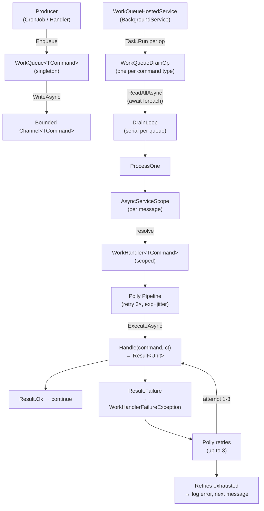

# Work-Queue System

**Date:** 2026-06-06
**Audience:** Project developer / owner

---

## 1. Summary

AnimeFeedManager uses an in-process, channel-backed work-queue. Each command type gets its own bounded `Channel<T>`, drained by a single dedicated loop that resolves a handler per message in a fresh DI scope and runs it under a Polly resilience pipeline. Producers inject `WorkQueue<TCommand>` and call `Enqueue`. The design is intentionally split into a **procedural shell** — DI wiring, channel management, retries, logging — and a **functional core** — the handler's `Handle` method returning `Result<Unit>`.

All core types live in `src/AnimeFeedManager.Infrastructure/Background/Queue/`.

---

## 2. Design at a Glance

**The split**

- The **procedural shell** owns: channel creation and sizing, scope lifecycle, Polly retry orchestration, the `Result → exception` bridge for retry signalling, and all logging.
- The **functional core** is the handler's `Handle` method. It returns `Result<Unit>` and knows nothing about retries, channels, or DI scopes.

**Core types and their roles**

| Type | Role |
|---|---|
| `WorkQueue<TCommand>` | Producer-side façade; thin wrapper over `Channel<T>.Writer` |
| `WorkHandler<TCommand>` | Abstract base; declares queue shape (capacity, full-mode) and the `Handle` contract |
| `WorkQueueDrainOp` | Type-erased record holding a named drain closure registered per command type |
| `WorkQueueRunner` | Static; contains `DrainLoop` and `ProcessOne` — the actual consume logic |
| `WorkQueueHostedService` | `BackgroundService`; collects all drain ops and launches them in parallel |
| `WorkQueueDefaults` | Static; builds the shared Polly retry pipeline (3 retries, exponential + jitter) |
| `WorkHandlerFailureException` | Bridges `Result` failure into Polly's exception-driven retry filter |

---

## 3. End-to-End Flow

### Prose

A producer (cron job, another handler, or any DI-resolved component) injects `WorkQueue<TCommand>` and calls `Enqueue`. The command is written to a bounded channel. On host startup, `WorkQueueHostedService.ExecuteAsync` collects every registered `WorkQueueDrainOp` and launches each one's drain closure via `Task.Run` — all queues drain **in parallel with each other**.

Each drain closure runs `WorkQueueRunner.DrainLoop`, which iterates the channel with `ReadAllAsync` — **serially**, one message at a time, within that queue. For each message, `ProcessOne` opens a fresh async DI scope, resolves the handler, picks the active Polly pipeline (handler override or shared default), then executes:

```
await pipeline.ExecuteAsync(async token => {
    var result = await handler.Handle(command, token);
    result.Match(onOk: _ => { }, onError: error => throw new WorkHandlerFailureException(error));
}, stoppingToken);
```

If `Handle` returns a failure, `WorkHandlerFailureException` is thrown so Polly sees an exception and retries. Once retries are exhausted, the outer catch logs the final error and moves on to the next message. An `OperationCanceledException` from the stopping token exits the loop cleanly.

### Diagram



---

## 4. Core Types Reference

### `WorkQueue<TCommand>`

```csharp
public sealed class WorkQueue<TCommand>(Channel<TCommand> channel)
```

- `public ValueTask Enqueue(TCommand command, CancellationToken cancellationToken = default)`
  — writes to the channel writer; back-pressures or drops depending on the channel's `FullMode`.
- `internal ChannelReader<TCommand> Reader` — exposed only to the drain loop.

One singleton instance per command type, created at registration time with the channel already sized.

---

### `WorkHandler<TCommand>` (abstract base)

```csharp
public abstract class WorkHandler<TCommand>
```

The handler is the **sole source of truth** for its queue's shape. Subclasses override properties to customise; defaults cover the common case.

| Virtual member | Default | Meaning |
|---|---|---|
| `int Capacity` | `100` | Bounded-channel capacity |
| `BoundedChannelFullMode FullMode` | `Wait` | Back-pressure producers when full |
| `ResiliencePipeline? ResiliencePipeline` | `null` | Falls back to shared default |

```csharp
public abstract Task<Result<Unit>> Handle(TCommand command, CancellationToken cancellationToken);
```

---

### `WorkQueueRunner` (static)

Contains two methods:

**`DrainLoop<TCommand, THandler>`** — the outer loop. Iterates `ChannelReader<TCommand>` with `await foreach ... ReadAllAsync(stoppingToken)`. Each item is handed to `ProcessOne`. Catches `OperationCanceledException` for clean shutdown.

**`ProcessOne`** — opens `await using var scope = scopes.CreateAsyncScope()` per message, resolves `THandler`, resolves `ILogger<THandler>`, picks the active pipeline, then runs the Polly execute block described in Section 3. Catches `WorkHandlerFailureException` after retries exhaust (logs error) and generic `Exception` (logs unhandled exception) — neither propagates to the drain loop, so one bad message does not stop the queue.

---

### `WorkQueueHostedService`

```csharp
internal sealed class WorkQueueHostedService(
    IEnumerable<WorkQueueDrainOp> drainOps,
    ILogger<...> logger) : BackgroundService
```

`ExecuteAsync`:
1. If no drain ops registered — logs a warning and returns.
2. Otherwise logs `"Work-queue host starting {Count} drain(s)"`.
3. `Task.Run(() => op.Drain(stoppingToken), stoppingToken)` for every op.
4. `await Task.WhenAll(...)`.

All queues drain **in parallel**; each is **serial** internally.

---

### `WorkQueueDrainOp`

```csharp
internal sealed record WorkQueueDrainOp(string HandlerName, Func<CancellationToken, Task> Drain);
```

The closure held in `Drain` is type-erased but captures the concrete `TCommand`, `THandler`, scope factory, and default pipeline at registration time. No `object` casting or reflection occurs at fire time.

---

### `WorkQueueDefaults` (static)

Builds the shared Polly pipeline:

```csharp
ResiliencePipelineBuilder()
    .AddRetry(new RetryStrategyOptions {
        MaxRetryAttempts = 3,
        Delay = TimeSpan.FromSeconds(1),
        BackoffType = DelayBackoffType.Exponential,
        UseJitter = true
    })
    .Build();
```

4 total attempts (1 original + 3 retries). Polly's default `ShouldHandle` retries all exceptions except `OperationCanceledException`, keeping shutdown clean.

---

### `WorkHandlerFailureException`

```csharp
internal sealed class WorkHandlerFailureException(DomainError error) : Exception(error.Message)
```

Carries the original `DomainError`. Thrown inside the Polly execute closure when `Handle` returns a failure result, making Polly treat it as a retryable failure. Once retries are exhausted, the outer catch reads `Error` for structured logging.

---

## 5. Registration & Lifetimes

### `AddWorkQueueHandler<TCommand, THandler>()`

Called on `IServiceCollection` inside a feature's registration method. One call makes **three** registrations:

1. **`AddScoped<THandler>()`** — handler is scoped; a fresh instance is created per message (per `ProcessOne` scope open).

2. **`AddSingleton` for `WorkQueue<TCommand>`** — at resolution time, a temporary scope is created, `THandler` is resolved once, its `Capacity` and `FullMode` properties are read, and the channel is built:

   ```csharp
   Channel.CreateBounded<TCommand>(new BoundedChannelOptions(handler.Capacity) {
       FullMode = handler.FullMode,
       SingleReader = true   // encodes the single-drain-loop assumption
   })
   ```

   **Important:** capacity and full-mode are read **once at host startup** and baked into the channel. Changing them requires a host restart.

3. **`AddSingleton` for `WorkQueueDrainOp`** — resolves the `WorkQueue<TCommand>` singleton and `IServiceScopeFactory`, builds the default pipeline, and returns a `WorkQueueDrainOp` whose `Drain` closure calls `WorkQueueRunner.DrainLoop`.

Because `WorkQueueDrainOp` is registered as a singleton multiple times (once per command type), `WorkQueueHostedService` collects all of them via `IEnumerable<WorkQueueDrainOp>`.

### `AddWorkQueueProcessor()`

Called on `IHostApplicationBuilder` by the host composition root. Registers `WorkQueueHostedService` as a hosted service. Must be called exactly once.

---

## 6. Concurrency, Back-Pressure & Retries

**Across queues — parallel.** Each drain op runs in its own `Task.Run`. A slow image-processing queue does not block the library-import queue.

**Within a queue — serial.** `DrainLoop` processes one message at a time. There is no concurrent dispatch within a single queue.

**Back-pressure modes.**

| `FullMode` | Behaviour when channel is full |
|---|---|
| `Wait` (default) | `Enqueue` awaits until space is available — back-pressures the producer |
| `DropOldest` | Oldest queued item is removed to make room; latest item always accepted |

**Retries.** The shared default pipeline (3 retries, exponential backoff, 1s base, jitter) applies unless the handler declares its own `ResiliencePipeline`. Per-handler overrides replace the default entirely — there is no stacking.

**Scope per message.** Each call to `ProcessOne` opens and disposes its own `IAsyncDisposable` DI scope. Handler state does not leak between messages.

---

## 7. Shutdown Semantics

When the host stopping token fires:

- `ReadAllAsync` exits cleanly; the drain loop stops accepting new messages.
- Any handler currently executing continues until it completes or observes the cancellation token itself.
- The host's configured `ShutdownTimeout` bounds the grace period.
- Items **still queued at shutdown are not processed** — they are silently dropped.

---

## 8. Current Command/Handler Pairs

| Command | Handler | Capacity | Full-Mode | Producer |
|---|---|---|---|---|
| `LibraryImportCommand(ImportTarget)` | `LibraryImportHandler` | 5 | `DropOldest` | `LibraryImportCronJob` (Saturday 04:00 UTC) |
| `ProcessSeriesImageCommand(Id, Season, SourceUrl, ParentContext)` | `ProcessSeriesImageHandler` | 200 | `Wait` | `LibraryImportHandler` (one per persisted series with a cover URL) |

Notes:
- `LibraryImportHandler` is also a **producer**: for each successfully persisted series that carries a cover URL it enqueues a `ProcessSeriesImageCommand`. A failed enqueue never fails the import (fire-and-forget).
- `ProcessSeriesImageCommand` carries an `ActivityContext` as `ParentContext` so image-processing distributed-tracing spans nest under the originating import trace across the queue boundary.
- `DropOldest` on the import queue reflects that queued-but-unprocessed import commands are stale; only the latest matters. `Wait` on the image queue reflects that no image work should be discarded.

---

## 9. Ceremony & Friction

This section is a neutral inventory of what a developer must touch to add a new command type today. No changes are proposed.

### Steps required

**(a) Define the command record.**
A new `sealed record` with whatever payload the handler needs. By convention this lives in the relevant feature folder alongside the handler.

**(b) Define the handler class.**
A class inheriting `WorkHandler<TCommand>` and implementing `Handle`. The handler also carries its queue's configuration:

- Override `Capacity` and `FullMode` if the defaults (100 / `Wait`) do not fit.
- Override `ResiliencePipeline` if the shared default (3 retries, exponential, 1s base) does not fit.
- The handler therefore has **two responsibilities**: expressing queue shape and processing logic.

**(c) Register the handler.**
One call in the relevant feature's registration method:

```csharp
services.AddWorkQueueHandler<TNewCommand, TNewHandler>();
```

This single call covers all three DI registrations (scoped handler, singleton queue, singleton drain op). No change to `AddWorkQueueProcessor` or `WorkQueueHostedService` is needed — the new drain op is automatically collected via `IEnumerable<WorkQueueDrainOp>`.

**(d) Wire a producer (if needed).**
Any component that needs to enqueue messages injects `WorkQueue<TNewCommand>` and calls `Enqueue`. If the producer is a new cron job, it also requires its own registration line; if the producer is an existing handler, only a constructor parameter is added.

---

### Observations (factual, no fixes)

**Low-ceremony aspects:**
- A single extension call (`AddWorkQueueHandler<,>`) hides three DI registrations. The developer does not manually create channels, drain loops, or Polly pipelines.
- Global usings (`System.Threading.Channels`, `AnimeFeedManager.Infrastructure.Background.Queue`) mean neither the command nor the handler file needs explicit import statements.
- `WorkQueueHostedService` automatically picks up new drain ops — no central list to update.

**Higher-ceremony aspects:**
- The handler class carries queue-shape configuration (`Capacity`, `FullMode`) in addition to processing logic. These two concerns are co-located by design but a reader adjusting queue shape must edit the handler file rather than the registration site.
- Capacity and full-mode are read from a temporary handler instance at **singleton build time**. To read those two values the factory opens a throwaway scope and fully instantiates the handler — resolving its entire dependency graph (HTTP clients, Cosmos factory, blob client, etc.) — purely to read two properties, then disposes it. Consequences: (1) the handler's full dependency graph must be resolvable the first time `WorkQueue<TCommand>` is resolved, and (2) changing queue shape requires a host restart — there is no runtime reconfiguration.
- There is no central command registry. Discovery of all active command types is achieved by querying DI for `IEnumerable<WorkQueueDrainOp>`; there is no compile-time inventory or documentation list that auto-updates.
- Adding a handler that needs a `ResiliencePipeline` override requires constructing a Polly pipeline in the handler file itself, with no shared helper beyond `WorkQueueDefaults` (which is not directly reusable from outside infrastructure).
