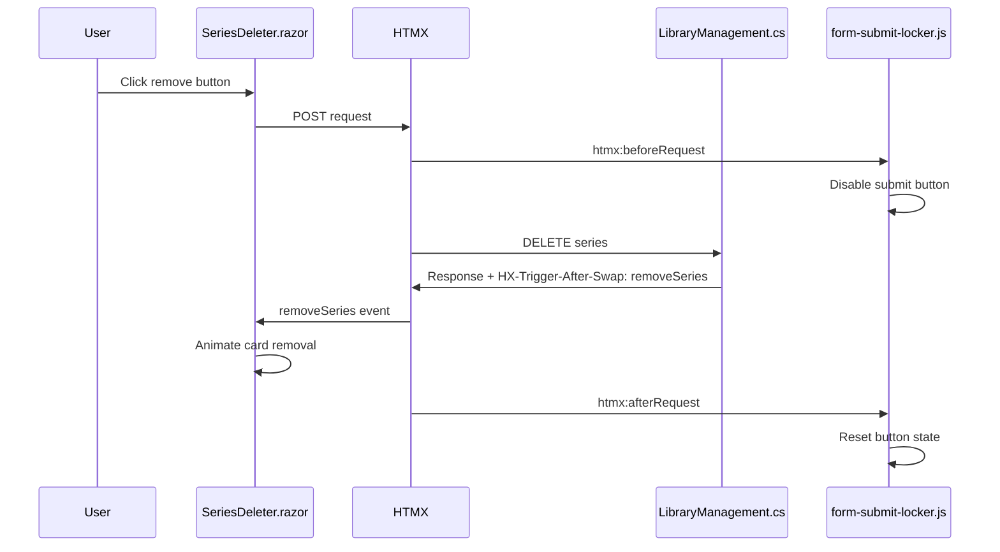
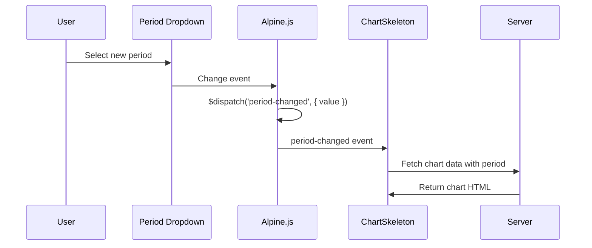

# Custom JavaScript Events

This document lists all custom JavaScript events used in the AnimeFeedManager.Web application, organized by category.

## Application Events (Server-Dispatched via HX-Trigger Headers)

These custom events are dispatched from the server via HTMX trigger headers.

| Event | Description | Payload | Dispatched From | Listened By |
|-------|-------------|---------|-----------------|-------------|
| `removeSeries` | Triggered after a series is successfully removed from the library | `{ owner: "{cardId}" }` | `LibraryManagement.cs:48-49` (HX-Trigger-After-Swap header) | `SeriesDeleter.razor:11` - Animates and removes the series card from DOM |

## Alpine.js Application Events

Custom events dispatched using Alpine.js `$dispatch()`.

| Event | Description | Payload | Dispatched From | Listened By |
|-------|-------------|---------|-----------------|-------------|
| `period-changed` | Fired when user selects a different time period for charts | `{ value: '7d'\|'14d'\|'30d'\|'60d'\|'90d' }` | `Charts.razor:3` | ChartSkeleton components - triggers chart reload with new period |
| `filter-changed` | Fired when user changes the grid filter selection | `{ filter: string }` | `GridFilter.razor:4` | `SeriesGrid.razor:12` - updates selectedFilter state, CSS handles show/hide |
| `alt-titles:saving` | Fired when alternative titles are being saved | - | Alternative titles editor | `AlternativeTitlesEditorModal.razor:14` - closes the dialog |

## SignalR Connection Events

Events dispatched by the custom SignalR extension for HTMX (`hx-signalr.js`).

### Connection Lifecycle

| Event | Description | Payload | Listened By |
|-------|-------------|---------|-------------|
| `htmx:signalr:starting` | Connection is being established | - | `HubStatus.razor:18` - Updates status to 'connecting' |
| `htmx:signalr:start` | Connection successfully established | `{ connectionId }` | `HubStatus.razor:19` - Updates status to 'connected', stores in localStorage |
| `htmx:signalr:start-error` | Connection failed to start | `{ message, errorType }` | `HubStatus.razor:20` - Updates status based on prior connection history |
| `htmx:signalr:reconnecting` | Lost connection, attempting to reconnect | `{ error }` | `HubStatus.razor:21` - Updates status to 'reconnecting' |
| `htmx:signalr:reconnected` | Successfully reconnected after disconnection | `{ connectionId }` | `HubStatus.razor:22` - Updates status to 'connected' |
| `htmx:signalr:close` | Connection closed | `{ error }` | `HubStatus.razor:23` - Updates status to 'error' or 'unavailable' |

### Message Events

| Event | Description | Payload | Purpose |
|-------|-------------|---------|---------|
| `htmx:signalr:message` | Message received from SignalR hub | Message content | Triggers DOM swap with server content |
| `htmx:signalr:beforeSend` | Before sending a message via SignalR | `{ method, headers, allParameters, filteredParameters }` | Allows intercepting/validating messages |
| `htmx:signalr:afterSend` | After sending a message via SignalR | `{ method, message }` | Signals successful message dispatch |

## HTMX Lifecycle Events (Built-in)

Standard HTMX events used by the application.

| Event | Description | Listened By | Purpose |
|-------|-------------|-------------|---------|
| `htmx:confirm` | Fired when HTMX needs user confirmation | `form-submit-locker.js:307`, `AlternativeTitlesEditor.razor:11` | Tracks form submission confirmation flow |
| `htmx:beforeRequest` | Fired before an HTMX request is sent | `form-submit-locker.js:308` | Disables submit button, sets aria-busy state |
| `htmx:afterRequest` | Fired after an HTMX request completes | `form-submit-locker.js:309` | Resets submit button state |
| `htmx:responseError` | Fired on HTTP error responses (4xx, 5xx) | `form-submit-locker.js:311`, `htmx-error-alert.js:164` | Resets form state, displays error alerts |
| `htmx:sendError` | Fired on network errors | `form-submit-locker.js:312`, `htmx-error-alert.js:178` | Resets form state, displays network error alerts |
| `htmx:timeout` | Fired when a request times out | `htmx-error-alert.js:185` | Displays timeout warning alert |
| `htmx:halted` | Fired when a request is cancelled | `form-submit-locker.js:314` | Resets submit button state |

## Form Submission Events (Custom Plugin)

Custom events used by the `form-submit-locker` Alpine.js plugin.

| Event | Description | Handler |
|-------|-------------|---------|
| `ajax:success` | AJAX request completed successfully | Resets submit button state |
| `ajax:error` | AJAX request failed | Resets submit button state |
| `submit:success` | Form submission succeeded | Resets submit button state |
| `submit:error` | Form submission failed | Resets submit button state |

## Alpine.js Initialization

| Event | Description | Files Registering |
|-------|-------------|-------------------|
| `alpine:init` | Fired when Alpine.js is initialized | `content-limit.js:77`, `form-submit-locker.js:405`, `invalid-cleaner.js:75` |

## Web Components

The `daisy-htmx-alerts` web component (`htmx-error-alert.js`) listens to:
- `htmx:responseError` - Displays styled error notifications based on HTTP status codes
- `htmx:sendError` - Displays network error notifications
- `htmx:timeout` - Displays timeout warning notifications

## Event Flow Examples

### Series Removal Flow

### Chart Period Selection Flow

