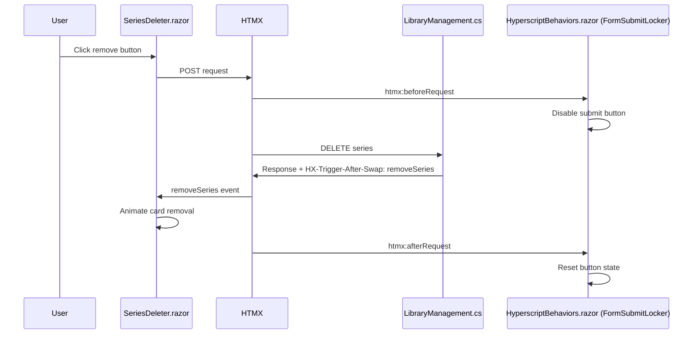
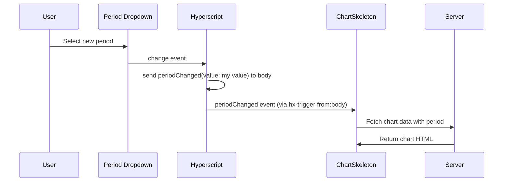

# Custom JavaScript Events

This document lists all custom JavaScript events used in the AnimeFeedManager.Web application, organized by category.

## Application Events (Server-Dispatched via HX-Trigger Headers)

These custom events are dispatched from the server via HTMX trigger headers.

| Event | Description | Payload | Dispatched From | Listened By |
|-------|-------------|---------|-----------------|-------------|
| `removeSeries` | Triggered after a series is successfully removed from the library | `{ owner: "{cardId}" }` | `LibraryManagement.cs:48-50` (HX-Trigger-After-Swap header) | `SeriesDeleter.razor:11` - Animates and removes the series card from DOM |

## Hyperscript Application Events

Custom events dispatched using hyperscript `send`.

| Event | Description | Payload | Dispatched From | Listened By |
|-------|-------------|---------|-----------------|-------------|
| `periodChanged` | Fired when user selects a different time period for charts | `{ value: '7d'\|'14d'\|'30d'\|'60d'\|'90d' }` | `Charts.razor:3` | ChartSkeleton components - triggers chart reload with new period |
| `filterChanged` | Fired when user changes the grid filter selection | `{ filter: string, label: string }` — `filter` is the value (`''`, `'available'`, `'subscribed'`, `'interested'`, `'completed'`, `'not-available'`); `label` is the pre-formatted display text shown in the dropdown trigger | `GridFilter.razor` (per-button click handlers) | `SeriesGrid.razor` — updates root `data-filter` attribute (CSS handles show/hide); `GridFilter.razor` itself — updates the trigger label and the selected-state check icon |

## Authentication Events

Custom events bridging client-side auth flows with HTMX form submission.

| Event | Description | Payload | Dispatched From | Listened By |
|-------|-------------|---------|-----------------|-------------|
| `loginComplete` | Fired after successful passwordless authentication verification | - | `LoginForm.razor.hs` (hyperscript `send loginComplete to me`) | `LoginForm.razor:5` - HTMX `hx-trigger` submits the login form to the server |

## SignalR Connection Events

Events dispatched by the custom SignalR extension for HTMX (`hx-signalr.js`).

### Connection Lifecycle

| Event | Description | Payload | Listened By |
|-------|-------------|---------|-------------|
| `htmx:signalr:starting` | Connection is being established | - | `HubStatus.razor:18` - Updates status to 'connecting' |
| `htmx:signalr:start` | Connection successfully established | `{ connectionId }` | `HubStatus.razor:19` - Updates status to 'connected', stores in localStorage |
| `htmx:signalr:start-error` | Connection failed to start | `{ message, errorType }` | `HubStatus.razor:20` - Updates status based on prior connection history |
| `htmx:signalr:reconnecting` | Lost connection, attempting to reconnect | `{ error }` | `HubStatus.razor:21` - Updates status to 'reconnecting' |
| `htmx:signalr:reconnected` | Successfully reconnected after disconnection | `{ connectionId }` | `HubStatus.razor:22` - Updates status to 'connected' |
| `htmx:signalr:close` | Connection closed | `{ error }` | `HubStatus.razor:23` - Updates status to 'error' or 'unavailable' |

### Message Events

| Event | Description | Payload | Purpose |
|-------|-------------|---------|---------|
| `htmx:signalr:message` | Message received from SignalR hub | Message content | Triggers DOM swap with server content |
| `htmx:signalr:beforeSend` | Before sending a message via SignalR | `{ method, headers, allParameters, filteredParameters }` | Allows intercepting/validating messages |
| `htmx:signalr:afterSend` | After sending a message via SignalR | `{ method, message }` | Signals successful message dispatch |

## HTMX Lifecycle Events (Built-in)

Standard HTMX events used by the application.

| Event | Description | Listened By | Purpose |
|-------|-------------|-------------|---------|
| `htmx:confirm` | Fired when HTMX needs user confirmation | `HyperscriptBehaviors.razor` (FormSubmitLocker behavior), `HtmxConfirm.razor` (shared dialog), `AlternativeTitlesEditor.razor.hs` | Tracks form submission confirmation flow; the shared HtmxConfirm dialog handles `event.detail.question` prompts |
| `htmx:beforeRequest` | Fired before an HTMX request is sent | `HyperscriptBehaviors.razor` (FormSubmitLocker behavior) | Disables submit button, sets aria-busy state |
| `htmx:afterRequest` | Fired after an HTMX request completes | `HyperscriptBehaviors.razor` (FormSubmitLocker behavior) | Resets submit button state |
| `htmx:responseError` | Fired on HTTP error responses (4xx, 5xx) | `HyperscriptBehaviors.razor` (FormSubmitLocker behavior), `htmx-error-alert.js:164` | Resets form state, displays error alerts |
| `htmx:sendError` | Fired on network errors | `HyperscriptBehaviors.razor` (FormSubmitLocker behavior), `htmx-error-alert.js:178` | Resets form state, displays network error alerts |
| `htmx:timeout` | Fired when a request times out | `htmx-error-alert.js:185` | Displays timeout warning alert |
| `htmx:halted` | Fired when a request is cancelled | `HyperscriptBehaviors.razor` (FormSubmitLocker behavior) | Resets submit button state |

## Web Components

The `daisy-htmx-alerts` web component (`htmx-error-alert.js`) listens to:
- `htmx:responseError` - Displays styled error notifications based on HTTP status codes
- `htmx:sendError` - Displays network error notifications
- `htmx:timeout` - Displays timeout warning notifications

## Event Flow Examples

### Series Removal Flow

```mermaid
sequenceDiagram
    participant User
    participant SeriesDeleter as SeriesDeleter.razor
    participant HTMX
    participant Server as LibraryManagement.cs
    participant FormLocker as HyperscriptBehaviors.razor (FormSubmitLocker)

    User->>SeriesDeleter: Click remove button
    SeriesDeleter->>HTMX: POST request
    HTMX->>FormLocker: htmx:beforeRequest
    FormLocker->>FormLocker: Disable submit button
    HTMX->>Server: DELETE series
    Server->>HTMX: Response + HX-Trigger-After-Swap: removeSeries
    HTMX->>SeriesDeleter: removeSeries event
    SeriesDeleter->>SeriesDeleter: Animate card removal
    HTMX->>FormLocker: htmx:afterRequest
    FormLocker->>FormLocker: Reset button state
```

### Chart Period Selection Flow

```mermaid
sequenceDiagram
    participant User
    participant Dropdown as Period Dropdown
    participant Hyperscript
    participant Chart as ChartSkeleton
    participant Server

    User->>Dropdown: Select new period
    Dropdown->>Hyperscript: change event
    Hyperscript->>Hyperscript: send periodChanged(value: my value) to body
    Hyperscript->>Chart: periodChanged event (via hx-trigger from:body)
    Chart->>Server: Fetch chart data with period
    Server->>Chart: Return chart HTML
```
